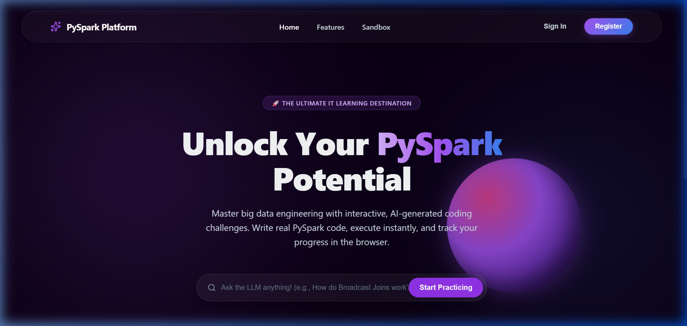
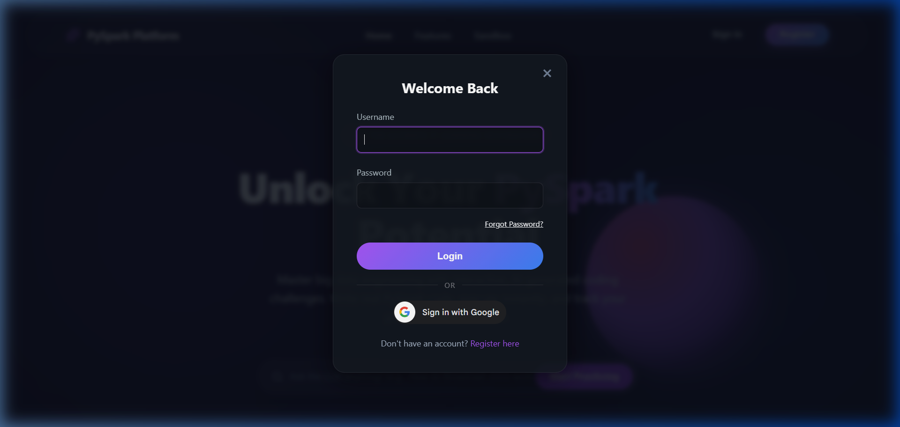
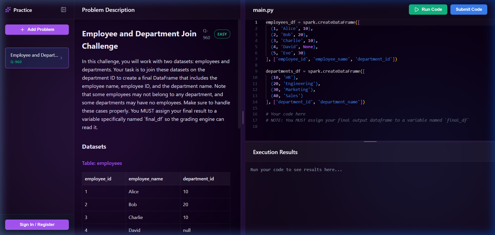
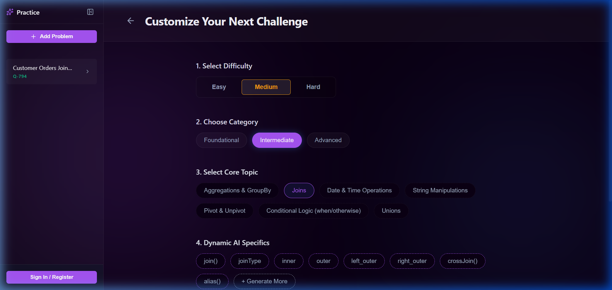

<div align="center">

# 🚀 Spark Lab Platform

**Master Big Data Engineering with AI-Powered Interactive Challenges**

[](https://pyspark-lab-app.vercel.app/)
[](https://huggingface.co/spaces/ayush260201/pyspark-lab)

*Write real PySpark & SQL code, execute instantly, and track your progress — all in the browser.*

</div>

---

## 📸 Screenshots

<div align="center">

### Landing Page


### Authentication (Google OAuth + Traditional)


### Interactive Code Editor & Problem Solving


### AI-Powered Problem Generation


</div>

---

## ✨ Features

### 🧠 AI-Generated Coding Challenges
- **Dynamic problem generation** powered by OpenAI GPT — no two sessions are the same
- **Multiple difficulty levels**: Easy, Medium, Hard
- **Topic-aware**: Covers PySpark DataFrame API, SQL Selects, Joins, Window Functions, and more
- **Subtopic drilling**: AI generates focused subtopics within each category

### ⚔️ Twin Challenge Multiplayer Mode
- **Invite a Friend**: Send a unique 6-character room code to challenge a friend.
- **Side-by-side Coding**: See each other's cursor and code in real-time using live WebSockets.
- **Voice & Text Chat**: Strategize or talk trash instantly using built-in WebRTC voice calling and text chat.
- **Real-Time Execution**: Both players run code against the exact same PySpark instance and datasets.

### ⚡ Real-Time PySpark & SQL Execution
- **Dual Sandbox Mode**: Seamlessly switch between writing native PySpark DataFrame logic or standard Spark SQL queries.
- **Server-side Apache Spark** execution — runs actual scalable code, not simulations
- **Monaco code editor** (same as VS Code) with syntax highlighting
- **Instant feedback** with execution results displayed as formatted tables
- **Auto-grading** with order-agnostic, type-forgiving comparison logic

### 🔐 Authentication System
- **Traditional login/register** with bcrypt password hashing & JWT tokens
- **Google OAuth 2.0** — one-click sign in with your Google account
- **Forgot Password** flow with email recovery codes (SMTP or log-based fallback)

### 📊 User Progress Tracking
- **XP system**: Earn 10/20/30 XP for Easy/Medium/Hard problems
- **Activity heatmap**: GitHub-style contribution calendar
- **Streak tracking**: Maintain daily solving streaks
- **Difficulty breakdown**: Visualize your solving patterns
- **Problem bookmarking**: Save challenges for later

### 🔍 AI-Powered Search
- Ask PySpark questions in natural language (e.g., *"How do broadcast joins work?"*)
- AI generates markdown-formatted explanations with code examples

### 🎨 Modern UI/UX
- Sleek dark theme with glassmorphism effects
- Responsive design that works on all screen sizes
- Smooth animations and micro-interactions
- Rich gradient aesthetics with a premium feel

---

## 🏗 Architecture

```
┌─────────────────┐     ┌──────────────────────┐     ┌─────────────────┐
│                 │     │                      │     │                 │
│   React + Vite  │────▶│  FastAPI + PySpark   │────▶│  Neon PostgreSQL│
│   (Vercel)      │     │  (HuggingFace Space) │     │  (Cloud DB)     │
│                 │◀────│                      │◀────│                 │
└─────────────────┘     └──────────────────────┘     └─────────────────┘
       │                         │
       │                         │
       ▼                         ▼
  Google OAuth              OpenAI GPT
  (ID Verification)        (Problem Gen)
```

---

## 🛠 Tech Stack

### Frontend
| Technology | Purpose |
|---|---|
| **React 18** | UI framework with hooks-based architecture |
| **Vite** | Lightning-fast build tool & dev server |
| **Monaco Editor** | VS Code-grade code editing experience |
| **Axios** | HTTP client for API communication |
| **React Markdown** | Rich markdown rendering for AI responses |
| **@react-oauth/google** | Google Sign-In integration |
| **Lucide React** | Beautiful icon system |

### Backend
| Technology | Purpose |
|---|---|
| **FastAPI** | High-performance Python API framework |
| **Apache PySpark** | Distributed data processing engine |
| **SQLAlchemy** | ORM for database operations |
| **PostgreSQL (Neon)** | Persistent cloud database |
| **OpenAI API** | GPT-powered problem generation |
| **bcrypt** | Secure password hashing |
| **PyJWT** | JSON Web Token authentication |
| **google-auth** | Google OAuth token verification |

### Infrastructure
| Service | Role |
|---|---|
| **Vercel** | Frontend hosting with auto-deploy |
| **Hugging Face Spaces** | Backend Docker hosting (16GB RAM free tier) |
| **Neon.tech** | Serverless PostgreSQL |
| **GitHub Actions** | CI/CD pipeline for auto-sync |

---

## 🚀 Getting Started

### Prerequisites
- Python 3.11+
- Java 11+ (for PySpark)
- Node.js 18+
- OpenAI API key

### Local Development

**1. Clone the repository**
```bash
git clone https://github.com/Ayush8811/pyspark-lab-app.git
cd pyspark-lab-app
```

**2. Backend setup**
```bash
cd backend
pip install -r requirements.txt

# Create .env file
echo "OPENAI_API_KEY=your-key-here" > .env
echo "DATABASE_URL=sqlite:///./pyspark_local.db" >> .env

# Run the server
uvicorn main:app --reload --port 8000
```

**3. Frontend setup**
```bash
cd frontend
npm install
npm run dev
```

**4. Open your browser**
Navigate to `http://localhost:5173` and start solving PySpark challenges!

---

## 🌐 Deployment

This project uses a fully automated CI/CD pipeline:

| Component | Hosting | Trigger |
|---|---|---|
| Frontend | Vercel | Auto-deploy on `git push` |
| Backend | HuggingFace Spaces | GitHub Actions sync on `git push` |
| Database | Neon.tech | Always-on serverless |

### Environment Variables

**Vercel (Frontend)**
| Variable | Description |
|---|---|
| `VITE_API_URL` | Backend API URL (HuggingFace Space URL) |
| `VITE_GOOGLE_CLIENT_ID` | Google OAuth Client ID |

**HuggingFace (Backend)**
| Variable | Description |
|---|---|
| `DATABASE_URL` | Neon PostgreSQL connection string |
| `OPENAI_API_KEY` | OpenAI API key for problem generation |
| `GOOGLE_CLIENT_ID` | Google OAuth Client ID |
| `SMTP_SERVER` | *(Optional)* SMTP server for emails |
| `SMTP_USER` | *(Optional)* SMTP email address |
| `SMTP_PASSWORD` | *(Optional)* SMTP app password |

---

## 📁 Project Structure

```
pyspark-lab-app/
├── frontend/
│   ├── src/
│   │   ├── App.jsx              # Main application component
│   │   ├── AuthModal.jsx        # Login/Register/Forgot Password modal
│   │   ├── AuthContext.jsx      # Authentication state management
│   │   ├── LandingPage.jsx      # Hero landing page
│   │   ├── ProfileDashboard.jsx # User stats & activity heatmap
│   │   ├── SettingsModal.jsx    # User profile settings
│   │   ├── config.js            # Environment configuration
│   │   └── *.css                # Component styles
│   └── package.json
│
├── backend/
│   ├── main.py                  # FastAPI routes & app entry point
│   ├── auth.py                  # JWT & bcrypt authentication
│   ├── models.py                # SQLAlchemy database models
│   ├── schemas.py               # Pydantic request/response schemas
│   ├── database.py              # Database connection & session
│   ├── spark_runner.py          # PySpark code execution engine
│   ├── ai_generator.py          # OpenAI GPT problem generator
│   ├── email_utils.py           # Email sending utility (SMTP)
│   ├── migrate_forgot_password.py # DB migration script
│   ├── requirements.txt         # Python dependencies
│   └── Dockerfile               # Container configuration
│
├── .github/
│   └── workflows/
│       └── sync-hf.yml          # CI/CD: GitHub → HuggingFace sync
│
└── README.md
```

---

## 🔒 Security

- Passwords are hashed with **bcrypt** (salt rounds, 72-byte truncation)
- Authentication via **JWT tokens** with configurable expiration
- Google OAuth tokens are verified server-side against Google's public keys
- Forgot password codes expire in **15 minutes**
- CORS is configured to allow cross-origin requests between Vercel and HF
- Database credentials are stored as **encrypted secrets** on hosting platforms

---

## 🤝 Contributing

1. Fork the repository
2. Create your feature branch (`git checkout -b feature/amazing-feature`)
3. Commit your changes (`git commit -m 'Add amazing feature'`)
4. Push to the branch (`git push origin feature/amazing-feature`)
5. Open a Pull Request

---

<div align="center">

**Built with ❤️ by [Ayush](https://github.com/Ayush8811)**

⭐ If you found this useful, please give it a star!

</div>
